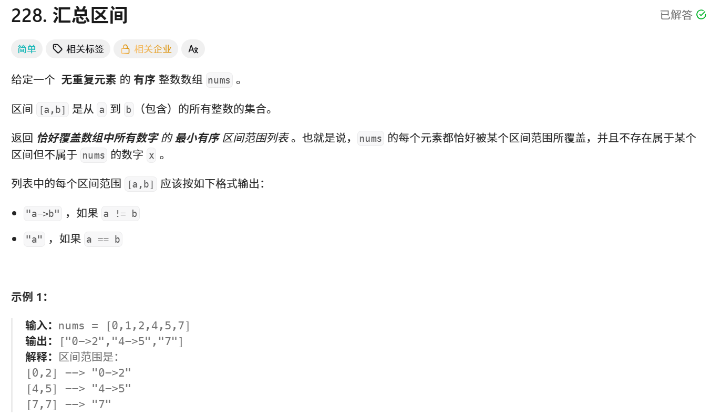

你提供的代码确实试图解决 LeetCode 228. 汇总区间（Summary Ranges）问题，但存在 **多个关键性错误**，导致在多种测试用例下会 **输出错误结果或遗漏内容**。下面我们逐条分析问题所在，并给出修复建议。

---

## ❌ 问题分析

### 🔴 1. **未处理最后一个区间**
你的循环是：
```python
for i in range(l - 1):
```
这意味着你只遍历到 `nums[l-2]`，**从未处理最后一个元素 `nums[-1]` 的归属**。

👉 **后果**：如果数组非空，最后一个连续段永远不会被加入结果 `r`。

✅ **举例**：
```python
nums = [0,1,2]
# 循环 i=0,1
# i=0: 0==1-1 → the_len=1
# i=1: 1==2-1 → the_len=2
# 循环结束，没有 else 分支触发，the_len=2 未被使用
# return [] → 错误！
```

---

### 🔴 2. **`the_len` 的语义混乱**
你用 `the_len` 表示“当前连续段中已累积的步数”，但它实际代表的是 **从起点到当前 `i` 的偏移量**。

- 初始 `the_len = 0`
- 当 `nums[i] == nums[i+1]-1` 时，`the_len += 1`

那么，在位置 `i`，当前连续段的**起始值应为 `nums[i] - the_len`**。

这在逻辑上是对的，**但仅当你在断开点或结尾正确使用它时才成立**。

然而，由于你没处理末尾，这个逻辑就失效了。

---

### 🔴 3. **单元素数组直接返回空列表**
如果 `nums = [5]`，则 `l = 1`，`range(l-1) = range(0)` → 循环不执行 → 直接 `return []`。

❌ 但正确答案应为 `["5"]`。

---

### 🔴 4. **边界情况全错**
| 输入 | 你的输出 | 正确输出 |
|------|--------|--------|
| `[]` | `[]` ✅ | `[]` |
| `[5]` | `[]` ❌ | `["5"]` |
| `[0,1,2]` | `[]` ❌ | `["0->2"]` |
| `[0,2,3]` | `["0"]` ❌（缺少 `"2->3"`）| `["0","2->3"]` |

---

## ✅ 修复建议

### 方案一：保留你的思路，但补全逻辑

你需要：
1. 在循环结束后 **手动处理最后一段**。
2. 正确计算起始位置。
3. 处理空数组和单元素数组。

```python
class Solution:
    def summaryRanges(self, nums: List[int]) -> List[str]:
        if not nums:
            return []
        
        r = []
        the_len = 0
        n = len(nums)
        
        for i in range(n - 1):
            if nums[i] + 1 == nums[i + 1]:  # 更清晰的写法
                the_len += 1
            else:
                start = nums[i] - the_len
                if the_len == 0:
                    r.append(str(start))
                else:
                    r.append(f"{start}->{nums[i]}")
                the_len = 0
        
        # 处理最后一段（关键！）
        start = nums[-1] - the_len
        if the_len == 0:
            r.append(str(start))
        else:
            r.append(f"{start}->{nums[-1]}")
        
        return r
```

> ✅ 这个版本修复了所有问题，且保持了你原有的“偏移量”思路。

---

### 方案二：更清晰的双指针写法（推荐）

```python
class Solution:
    def summaryRanges(self, nums: List[int]) -> List[str]:
        if not nums:
            return []
        
        res = []
        start = nums[0]
        
        for i in range(1, len(nums)):
            if nums[i] != nums[i-1] + 1:
                if start == nums[i-1]:
                    res.append(str(start))
                else:
                    res.append(f"{start}->{nums[i-1]}")
                start = nums[i]
        
        # 添加最后一段
        if start == nums[-1]:
            res.append(str(start))
        else:
            res.append(f"{start}->{nums[-1]}")
        
        return res
```

> 💡 这种写法逻辑更直观，不易出错，面试推荐。

---

## 📌 总结：原代码的主要问题

| 问题 | 后果 | 修复方式 |
|------|------|--------|
| 未处理最后一个区间 | 结果缺失 | 循环后手动添加最后一段 |
| 循环范围 `range(l-1)` | 单元素数组返回空 | 特判或确保末尾处理 |
| `the_len` 未在结尾使用 | 连续段丢失 | 循环外必须处理 `the_len` |
| 未考虑空输入 | 可能报错（但这里没报） | 加 `if not nums: return []` |

---

✅ **最终建议**：虽然你的思路可行，但**边界处理不完整**。编程中，“处理完循环后是否还有剩余”是这类题目的核心陷阱，务必养成检查的习惯。