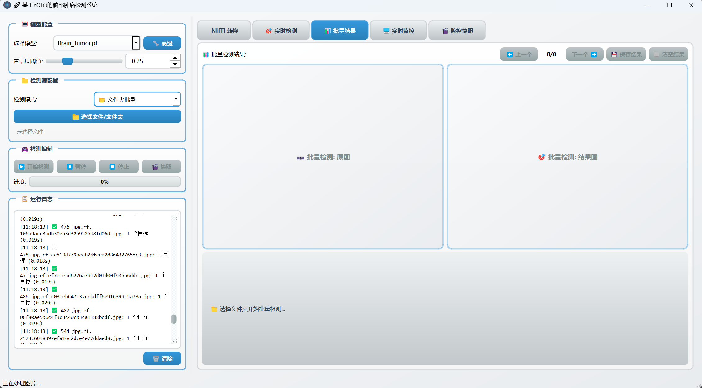
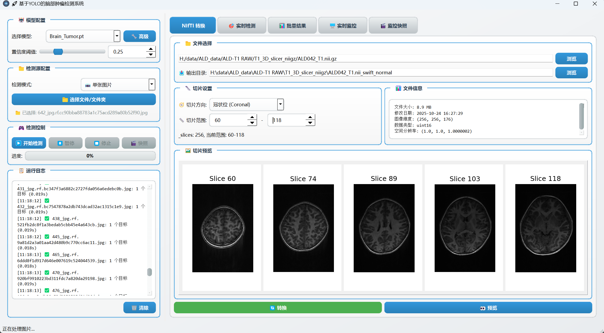
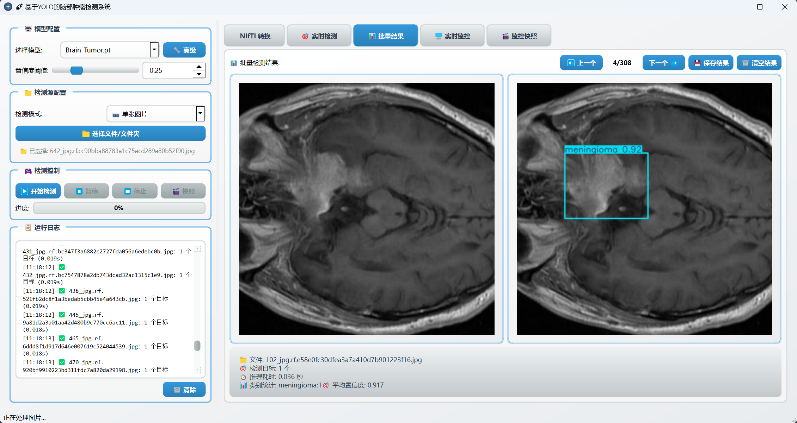

# 🧠 Brain-Tumor-YOLO｜一键脑肿瘤检测桌面工具

> 10 秒看懂：把 MRI/CT 图片、视频甚至摄像头画面拖进窗口，**3 类常见脑肿瘤（胶质瘤/脑膜瘤/垂体瘤）秒级框出**，批量出图 + 自动生成报告。专为**影像科、神经外科、AI 科研**打造，无需编程，Windows 即开即用。[视频介绍](https://www.bilibili.com/video/BV12ayWBREpF/?vd_source=ea444bcb59e16e58cfdca990f3514384)

| 一键下载                                                                 | 一键运行 |
|----------------------------------------------------------------------|---|
| 📦 [点击下载可执行.exe](https://www.123865.com/s/n9SYvd-rZhwd?pwd=6666) 已打包 | `pip install -r requirements.txt && python Brain_Tumor_detection_ui.py` |

---

## 🚀 30 秒速览

| 场景 | 过去 | 现在               |
|---|---|------------------|
| 门诊初筛 | 人工逐片 5–10 min | 批量拖入，平均 0.2 s/张  |
| 回顾性研究 | 标注 + 统计 2 h 起 | 自动出报告（PNG + TXT） |
| 科研预处理 | NIfTI → PNG 写脚本 | 3 步点击，矢/冠/轴位一次导出 |

✅ 支持单图 / 视频 / 摄像头 / 文件夹  
✅ 置信度滑块实时调  
✅ 结果快照、录像、报告一键导出  
✅ 额外附赠：NIfTI 转 PNG 切片小工具

---

## 📷 先看效果

| 初始化界面 | NIfTI 切片告 | 单张检测 |
|-------|---|---|
|  |  |  |

---

## 🛠️ 3 分钟上手

1. 拿到模型  
   下载 `*.pt` 权重（例：`yolov8n_brain_tumor.pt`）→ 扔进 `/models` 文件夹。  
   *类别必须与代码对应：0-glioma｜1-meningioma｜2-pituitary*

2. 安装依赖  
   ```bash
   git clone https://github.com/junior6666/PI-MAPP.git
   cd PI-MAPP/project/Brain_Tumor_dection_ui
   pip install -r requirements.txt   # 若缺失，手动：PySide6 ultralytics opencv-python nibabel
   ```

3. 启动  
   ```bash
   python Brain_Tumor_detection_ui.py
   ```

4. 打包（可选）  
   ```bash
   pyinstaller -F -w --name Brain_Tumor_detection_ui Brain_Tumor_detection_ui.py
   ```

---

## 📖 标签页说明

| 标签 | 用途 | 快捷操作 |
|---|---|---|
| 🔍 实时检测 | 单图/视频/摄像头 | 拖文件→调阈值→Start |
| 📂 批量结果 | 整个文件夹推理 | 自动保存标注图 + 报告 |
| 🗂️ NIfTI 转换 | 医学体积→PNG 序列 | 选 `.nii.gz`→选方位→Convert |
| 📷 快照/录像 | 摄像头模式 | 空格快照，R 键录像 |

---

## 📁 项目结构

```
Brain_Tumor_dection_ui/
├── Brain_Tumor_detection_ui.py   # 主入口
├── models/                       # 放 *.pt
├── utils/                        # 工具脚本
├── img/                          # 截图
├── requirements.txt
└── README.md
```

---

## ⚠️ 免责声明（点击展开）
<details>
<summary>展开/收起</summary>

本项目仅供**教学、科研和技术交流**，不得用于临床诊疗。  
检测结果**不能替代执业医师判断**。因使用本工具引发的任何直接或间接损失，开发者不承担法律责任。
</details>

---

## 🤝 贡献 & 更新

欢迎 Star / Fork / 提 Issue & PR  
持续更新：DICOM 支持｜3D 可视化｜云端推理｜多语言报告

---

Last update: 2025-10-27