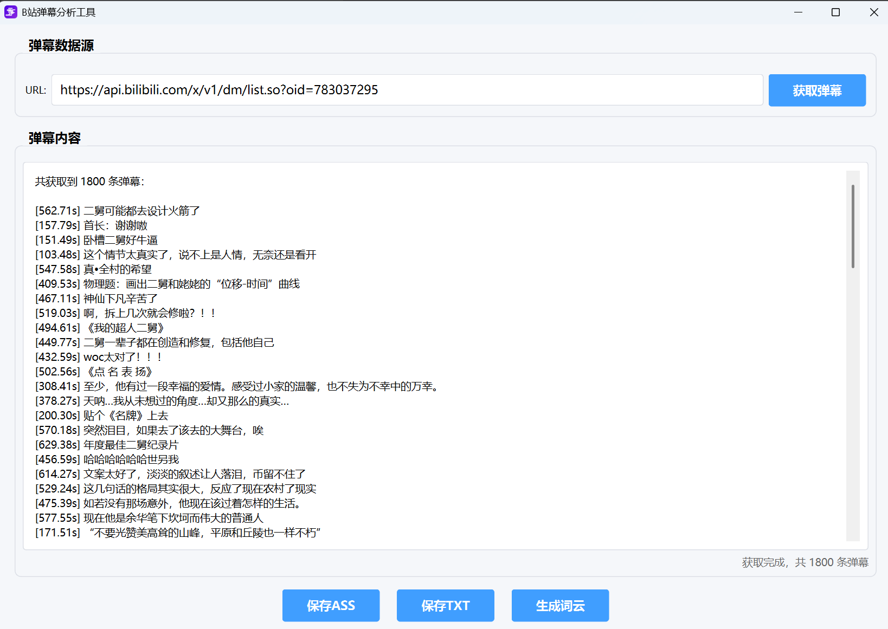

# B站弹幕分析工具使用说明

## 项目简介
## [提供绿色可执行文件>>>点击获取](https://github.com/JingW-ui/PI-MAPP/releases/)

这是一个基于PySide6开发的B站弹幕分析工具，具有以下功能：

- **弹幕抓取**：从B站API获取弹幕数据
- **格式转换**：支持保存为TXT和ASS字幕文件
- **词云生成**：基于弹幕内容生成可视化词云图
- **GUI界面**：直观的操作界面

## 功能演示

<div style="display: flex; gap: 20px; align-items: center;">
    
    

</div>

## 依赖安装

```
bash
pip install requests xmltodict PySide6 jieba numpy pillow wordcloud matplotlib
```
## 操作步骤

### 1. 启动程序
运行 [danmu_ciyun.py](file://H:\pycharm_project\PI-MAPP\project\Danmaku_scraping\danmu_ciyun.py) 文件启动图形界面。

### 2. 输入弹幕API URL
- 在URL输入框中填入B站弹幕API地址
- 默认URL格式：`https://api.bilibili.com/x/v1/dm/list.so?oid=[视频oid]`
- 可以直接使用默认示例URL进行测试

### 3. 获取弹幕数据
- 点击 **"获取弹幕"** 按钮
- 程序会自动解析URL中的oid参数并请求弹幕数据
- 获取完成后会在下方文本区域显示弹幕内容

### 4. 保存弹幕数据
根据需求选择保存格式：

#### 保存为TXT格式
- 点击 **"保存TXT"** 按钮
- 选择保存位置和文件名
- 生成纯文本格式的弹幕文件

#### 保存为ASS字幕格式
- 点击 **"保存ASS"** 按钮
- 选择保存位置和文件名
- 生成可在视频播放器中使用的字幕文件

### 5. 生成词云
- 点击 **"生成词云"** 按钮
- 选择保存位置和文件名
- 程序会自动生成词云图片并在新窗口中预览

## 法律声明

本工具仅供个人学习和研究使用，不得用于商业用途。用户在使用本工具时应遵守以下规定：

- 请勿滥用B站API，避免对服务器造成过大压力
- 请尊重视频创作者的版权，不得将获取的数据用于非法传播或商业盈利
- 本工具不保证数据的完整性和准确性，使用者需自行承担风险
- 如因使用本工具导致的任何法律纠纷，开发者概不负责
- 请遵守《中华人民共和国网络安全法》等相关法律法规

## 功能详解

### 弹幕爬取功能
- [BilibiliDanmuCrawler](file:///H:/pycharm_project/PI-MAPP/project/Danmaku_scraping/danmu_ciyun.py#L20-L111) 类负责处理弹幕数据获取
- 自动解析XML格式的弹幕数据
- 提取包括时间、模式、颜色、内容等详细信息

### 词云生成功能
- [WordCloudGenerator](file:///H:/pycharm_project/PI-MAPP/project/Danmaku_scraping/danmu_ciyun.py#L163-L232) 类负责生成词云
- 使用jieba进行中文分词
- 支持自定义字体和形状蒙版
- 过滤常见停用词

### 多线程处理
- [CrawlerThread](file:///H:/pycharm_project/PI-MAPP/project/Danmaku_scraping/danmu_ciyun.py#L235-L249) 类实现异步弹幕获取
- 避免界面卡顿
- 提供进度反馈

## 文件结构

- [danmu_ciyun.py](file://H:\pycharm_project\PI-MAPP\project\Danmaku_scraping\danmu_ciyun.py) - 主程序文件
- 临时文件：`temp_danmu.txt`（自动生成和清理）

## 注意事项

1. **网络连接**：确保有稳定的网络连接
2. **API限制**：注意B站API访问频率限制
3. **字体文件**：词云功能需要中文字体支持（如msyh.ttc）
4. **权限问题**：确保对保存目录有写入权限

## 常见问题

- 如果获取弹幕失败，请检查URL格式是否正确
- 词云生成需要一定时间，请耐心等待
- 如遇字体问题，可修改[wordcloud_generator](file:///H:/pycharm_project/PI-MAPP/project/Danmaku_scraping/danmu_ciyun.py#L163-L232)中的字体路径

## 开发说明

- 使用Python 3.x环境开发
- GUI基于PySide6框架
- 遵循模块化设计原则
- 代码包含完整的异常处理机制

