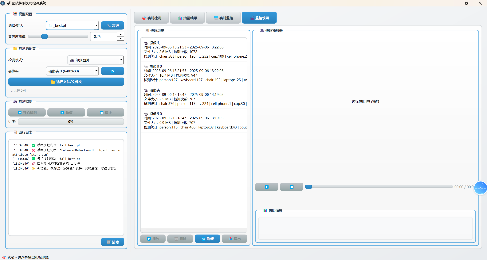

# 跌倒检测系统 (Fall Detection System) 🚑

一个基于[https://github.com/junior6666/PI-MAPP/tree/main/project/universal_object_detection_plus](https://github.com/junior6666/PI-MAPP/tree/main/project/universal_object_detection_plus)的实时跌倒检测系统，提供批量检测、多摄像头监控、视频录制和快照回放等功能。 👀

## 项目概述 📋

* 本项目是一个综合性的跌倒检测系统，利用先进的YOLO目标检测模型实现对人体跌倒行为的实时监测。系统支持单图像检测、批量图像处理、多摄像头实时监控以及监控快照的保存和回放功能。 💡
* 监控快照功能预览 [视频介绍](https://www.bilibili.com/video/BV1e4aBzcEyY/)
* 同时支持实时检测中对视频和摄像头的快照记录 默认最大保存时长24小时

## 主要功能 ✨

### 1. 批量检测 (Batch Detection) 📷
- 支持多种图像格式（JPG, PNG, BMP, TIFF, WebP等）
- 批量处理整个文件夹中的图像
- 实时进度跟踪和错误处理
- 详细的检测结果展示和统计

### 2. 多摄像头监控 (Multi-Camera Monitoring) 🎥
- 同时连接和监控多个摄像头
- 实时跌倒检测和状态显示
- 摄像头状态监控和自动重连机制
- 灵活的摄像头控制（开始、暂停、停止）

### 3. 监控快照 (Monitoring Snapshots) 📸
- 自动保存检测到异常的视频片段
- 视频录制和元数据保存
- 内存使用监控和自动清理
- 快照历史查看和回放

### 4. 快照回放 (Snapshot Playback) ▶️
- 历史监控快照的管理和回放
- 视频播放控制（播放、暂停、停止、进度控制）
- 快照详细信息展示
- 快照导出和删除功能

## 核心组件 ⚙️

### BatchDetectionThread
批量图像检测线程，负责处理文件夹中的所有图像文件并执行跌倒检测。

### MultiCameraMonitorThread
多摄像头监控线程，管理多个摄像头连接并执行实时跌倒检测。

### DetectionResultWidget
检测结果显示组件，以表格形式展示检测结果和统计信息。

### MonitoringWidget
监控页面组件，提供摄像头监控控制和显示功能。

### CameraVideoRecorder
摄像头视频录制器，负责录制和保存检测到异常的视频片段。

### SnapshotWidget
监控快照组件，用于管理和回放已保存的监控快照。

## 技术栈 💻

- **编程语言**: Python 3 🐍
- **GUI框架**: PySide6 (Qt for Python) 🖼️
- **计算机视觉**: OpenCV 📹
- **目标检测**: Ultralytics YOLO 🔍
- **数值计算**: NumPy 🔢

## 安装和使用 🛠️

### 参考原项目readme
项目地址：https://github.com/junior6666/PI-MAPP/tree/main/project/universal_object_detection_plus

## 项目打包
pyinstaller -F -w --name YOLO_D_UI1.0.2 dabao_main.py