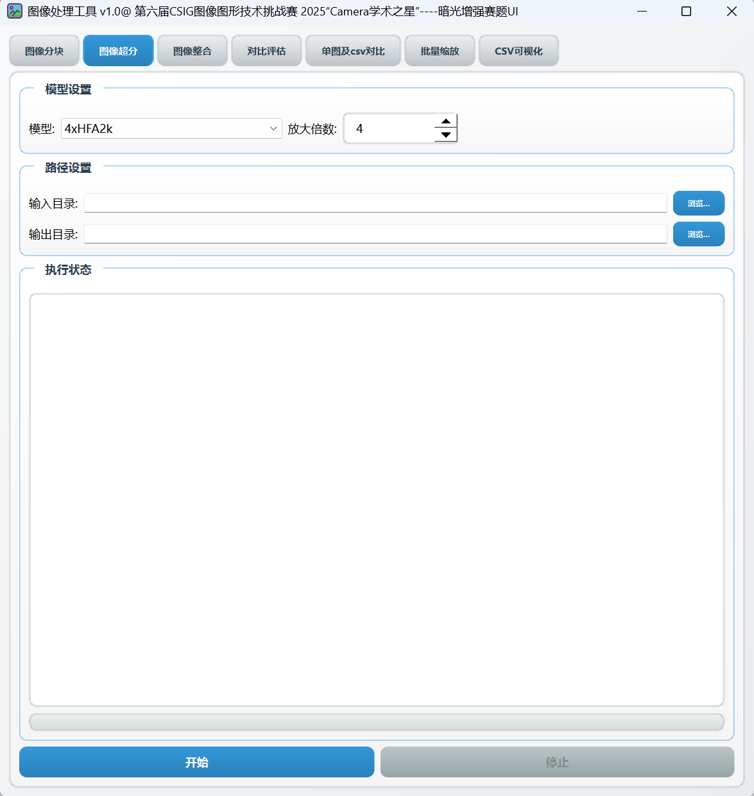

# 图像处理工具 (Image Processor GUI)

一个功能丰富的图像处理图形界面应用程序，集成了图像分块、整合、评估、对比和批量缩放等功能。
界面预览

## 功能特性

### 1. 图像分块
- 将大尺寸图像分割成指定大小的块
- 支持多种图像格式（.png, .jpg, .jpeg, .bmp）
- 可自定义分块尺寸（默认1024x1024）

### 2. 图像整合
- 将分块的图像重新整合成完整图像
- 自动识别和匹配分块文件
- 支持多种命名格式的分块文件

### 3. 图像质量评估
- 批量计算图像质量指标：
  - PSNR (峰值信噪比)
  - SSIM (结构相似性指数)
  - LPIPS (感知图像相似度，可选)
- 生成评估结果CSV文件

### 4. 图像对比
#### 单图对比
- 可视化对比处理图和真值图(GT图)
- 实时滑动条控制对比区域
- 显示PSNR、SSIM和LPIPS值

#### CSV对比
- 对比两个评估结果CSV文件
- 可视化显示PSNR、SSIM和LPIPS差异
- 统计分析差值的均值、标准差、方差和最大值

### 5. 批量图像缩放
- 批量调整图像尺寸
- 支持多种插值算法：
  - Lanczos3
  - Mitchell-Netravali
  - Area
- 可选缩放比例（2×到8×）
- 支持多种输出格式（.jpg, .png, .bmp, .tiff）

## 安装要求

### 系统要求
- Python 3.7+
- Windows/Linux/macOS

### 依赖库
```bash
pip install opencv-python
pip install numpy
pip install pandas
pip install scikit-image
pip install matplotlib
pip install PySide6
```


### 可选依赖（用于LPIPS计算）
```bash
pip install lpips
pip install torch
```


## 使用方法

### 启动程序
```bash
python image_processor_gui.py
```


### 标签页说明

#### 1. 图像分块
1. 选择包含待分块图像的文件夹
2. 选择输出分块文件的文件夹
3. 设置分块尺寸（宽×高）
4. 点击"开始分块"按钮

#### 2. 图像整合
1. 选择包含分块图像的文件夹
2. 选择整合后图像的输出文件夹
3. 设置分块尺寸（需与分块时一致）
4. 点击"开始整合"按钮

#### 3. 对比评估
1. 选择预测图（处理后图像）文件夹
2. 选择真值图（GT图）文件夹
3. 设置评估结果CSV文件名
4. 点击"开始评估"按钮

#### 4. 单图及CSV对比
包含两个子标签页：

##### 单图对比
1. 选择处理图（预测图）文件
2. 选择真值图（GT图）文件
3. 点击"开始对比"按钮查看结果
4. 使用滑动条调整对比区域

##### CSV对比
1. 选择两个要对比的CSV评估结果文件
2. 点击"对比CSV文件"按钮查看可视化结果
3. 点击"清空对比"按钮重置对比结果

#### 5. 批量缩放
1. 选择输入图像文件夹
2. 选择输出图像文件夹
3. 选择插值算法
4. 设置缩放比例
5. 选择输出图像格式
6. 点击"开始"按钮执行批量缩放

## 界面说明

### 主界面
- 采用现代化渐变UI设计
- 五个功能标签页，方便切换不同功能
- 实时进度条显示任务进度
- 详细日志记录操作过程

### 图像对比界面
- 实时滑动条控制对比分割位置
- 红色分割线清晰标识对比边界
- 可视化显示图像质量评估指标

### CSV对比界面
- 多指标对比图表（PSNR、SSIM、LPIPS）
- 双Y轴显示不同量级指标
- 自动统计差值信息

## 注意事项

1. 图像分块时，图像尺寸必须能被分块尺寸整除
2. 进行图像对比时，两张图像必须具有相同尺寸
3. LPIPS计算需要安装额外的依赖库（torch和lpips）
4. 处理大尺寸图像或大量图像时，可能需要较长时间
5. 确保输入文件夹中只包含支持的图像格式文件

## 文件命名规范

### 分块文件
分块文件命名格式为：`basename_yy_xx.jpg`
- basename: 原图像文件名（不含扩展名）
- yy: 行索引（从0开始）
- xx: 列索引（从0开始）

例如：`image_00_00.jpg`, `image_00_01.jpg`, `image_01_00.jpg`

### 评估结果CSV
CSV文件包含以下列：
- Image: 图像文件名
- PSNR: 峰值信噪比值
- SSIM: 结构相似性指数值
- LPIPS: 感知图像相似度值（如果计算了该指标）

## 开发者信息

本工具使用Python和PySide6开发，集成了OpenCV、NumPy、Pandas、Scikit-image和Matplotlib等库。

## 许可证

[待定]