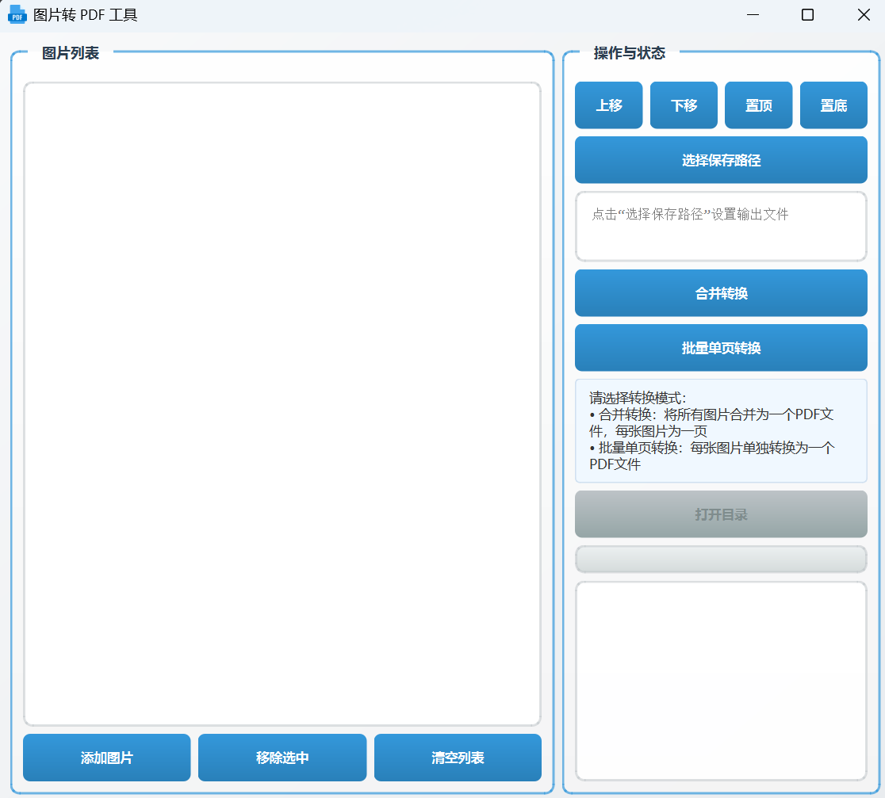

图片转 PDF 工具

基于 PySide6 的单文件 GUI 应用，支持图片拖拽、排序、预览及两种 PDF 转换模式。

界面预览

功能特性

• 多图管理：添加/移除/清空图片，支持拖拽导入

• 顺序调整：上移/下移/置顶/置底图片顺序

• 图片预览：双击列表项查看高清预览（支持 Ctrl+滚轮缩放）

• 双转换模式：

  • 合并转换：所有图片合并为单个 PDF（A4 尺寸）

  • 批量单页转换：每张图片单独生成 PDF（同名 .pdf）

• 智能路径：自动生成不重复输出路径（如 output_0.pdf）

• 进度反馈：实时进度条 + 状态日志

依赖安装

pip install PySide6 img2pdf

使用方法

1. 运行脚本启动程序
2. 添加图片：点击「添加图片」或拖拽图片到窗口
3. 调整顺序：使用方向按钮调整图片在 PDF 中的顺序
4. 选择模式：
   • 合并转换：需设置输出路径（默认 output_X.pdf）

   • 批量转换：自动在原图目录生成 PDF

5. 点击对应转换按钮开始处理
6. 完成后通过「打开目录」查看结果

界面说明

• 左侧：图片列表（显示文件名，存储完整路径）

• 右侧：

  • 顺序调整按钮

  • 输出路径选择与显示

  • 转换模式按钮

  • 进度条与状态日志

  • 打开目录按钮（转换成功后激活）

注意事项

• 支持格式：JPG/JPEG/PNG/BMP/GIF

• 批量转换时若目标 PDF 已存在，自动添加数字后缀（如 image_0.pdf）

• 预览窗口支持 Ctrl+滚轮缩放（0.1x~10x），适配大尺寸图片

运行

直接执行 Python 脚本即可启动（需提前安装依赖）：
python 脚本名.py

pyinstaller -F -w -i app.ico --add-data "app.ico;." --name="img2pdf" main_ui_img2pdf.py
