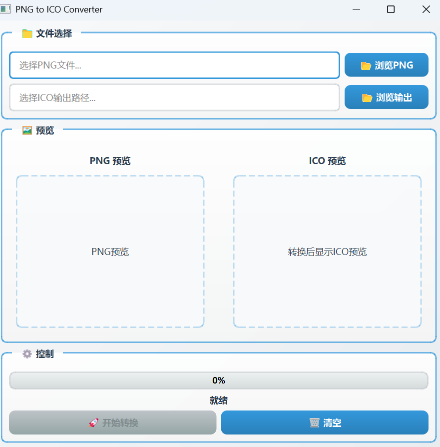

# PNG to ICO Converter

一个使用 PySide6 和 Pillow 库开发的 PNG 到 ICO 格式转换工具，具有现代化的图形用户界面。
<p align="center">
  
</p>

## 功能特性

- 📁 **文件选择**：支持浏览选择 PNG 输入文件和 ICO 输出路径
- 🖼️ **图像预览**：实时预览 PNG 输入图像和转换后的 ICO 图像
- 🚀 **批量转换**：自动生成多种尺寸的图标（64x64、128x128、256x256）
- ⚡ **后台转换**：使用多线程技术，确保界面响应流畅
- 📊 **进度显示**：实时显示转换进度条
- 🎨 **现代化 UI**：采用渐变色彩和圆角设计，提供美观的用户体验

## 依赖库

项目使用以下 Python 库：

- `PySide6`：用于构建图形用户界面
- `Pillow`：用于图像处理和格式转换

## 安装步骤

1. 确保已安装 Python 3.6 或更高版本
2. 克隆或下载项目到本地
3. 进入项目目录：
   ```bash
   cd h:\pycharm_project\PI-MAPP\project\picture_tools\png2ico
   ```
4. 安装依赖库：
   ```bash
   pip install -r requirements.txt
   ```

## 使用说明

1. 运行应用程序：
   ```bash
   python png2ico_ui.py
   ```

2. 使用步骤：
   - 点击「📂 浏览PNG」按钮选择要转换的 PNG 文件
   - 系统会自动生成 ICO 输出路径，也可以点击「📂 浏览输出」按钮自定义
   - 查看 PNG 预览图像
   - 点击「🚀 开始转换」按钮开始转换过程
   - 转换完成后，可以查看 ICO 预览图像
   - 点击「🗑️ 清空」按钮重置所有设置

## 项目结构

```
png2ico/
├── png2ico_ui.py    # 主程序文件，包含UI和转换逻辑
├── requirements.txt # 项目依赖列表
└── README.md        # 项目说明文档
```

## 开发说明

### 主要组件

1. **StyleManager**：管理应用程序的样式表，提供现代化的UI设计
2. **ConvertThread**：转换线程类，在后台执行PNG到ICO的转换操作
3. **PNGtoICOConverter**：主窗口类，处理用户界面和用户交互

### 转换流程

1. 用户选择 PNG 文件和输出路径
2. 创建 ConvertThread 线程执行转换
3. 在后台线程中：
   - 打开 PNG 文件
   - 转换为 RGBA 模式
   - 调整为多种尺寸（64x64、128x128、256x256）
   - 保存为 ICO 格式
4. 更新进度条和状态信息
5. 转换完成后显示结果和预览

## 技术特点

- **线程安全**：使用 QThread 确保界面在转换过程中保持响应
- **图像质量**：使用 Lanczos 重采样算法保证图像质量
- **错误处理**：完善的异常处理机制，提供友好的错误提示
- **用户体验**：直观的界面设计和清晰的操作流程

## 许可证

本项目采用 MIT 许可证。

## 联系方式及问题

见github主页 如有问题或建议，请随时提出。
