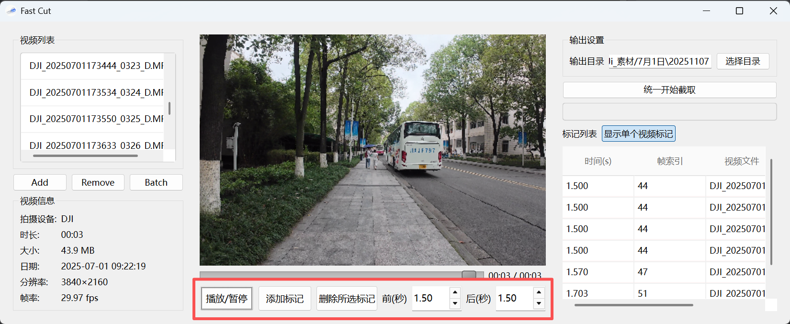

## Fast Cut Pro

Fast Cut Pro 是一个基于 `PySide6` 和 `OpenCV` 的桌面工具，可帮助你快速浏览长视频、为关键画面打点并批量截取前后片段。它适合体育集锦、监控筛选、采访整理等需要快速定位精彩瞬间的场景。

### 主要功能
- 支持批量导入单个文件或整个文件夹的多种视频格式（mp4/mov/mkv/avi 等）。
- 逐帧预览视频，实时显示时间轴、帧索引、分辨率、帧率等信息。
- 一键添加/删除标记，可为每个视频独立设置截取的前后时长。
- 标记列表支持单视频/全视频两种模式，方便统一检视关键点。
- 调用本地 `ffmpeg`，按标记批量导出短视频片段，并实时显示进度。

### 环境要求
- Windows 10/11（其他桌面系统同样可以运行，但需自行测试）。
- Python 3.10 及以上版本。
- 安装 `ffmpeg` 并确保其可在命令行中调用（已加入系统 `PATH`）。

### 安装步骤
1. 克隆或下载仓库代码，并进入项目目录：
   ```bash
   git clone <your-repo-url>
   cd project/video_tools/fast_cut_pro
   ```
2. 建议创建虚拟环境：
   ```bash
   python -m venv .venv
   .venv\Scripts\activate    # Windows PowerShell
   ```
3. 安装依赖：
   ```bash
   pip install -r requirements.txt
   ```
4. 确认 `ffmpeg` 已安装并可用：
   ```bash
   ffmpeg -version
   ```

### 快速开始
```bash
cd project/video_tools/fast_cut_pro
python main.py
```

首次启动会显示一个桌面窗口：
- 点击 “Add”/“Batch” 导入视频文件；
- 在播放界面中使用 “播放/暂停” 以及滑块控制进度；
- 按下 `M` 或点击 “添加标记” 将当前画面加入标记列表；
- 在右侧设置输出目录及截取前后时长，最后点击 “统一开始截取”。

### 使用提示
- 当视频较多时，可使用标记列表右上角的模式切换按钮在“当前视频”与“所有视频”之间切换视图。
- 如果导出失败，请检查 `ffmpeg` 是否正确安装，或在设置中尝试更换输出目录。
- 默认输出目录会根据视频所在路径和当天日期自动生成，可手动修改。

### 项目结构
```text
fast_cut_pro/
├─ main.py                # 应用入口，启动 Qt 主窗口
├─ extractor.py           # 调用 ffmpeg 执行批量截取逻辑
├─ models.py              # 标记及视频数据模型
├─ video_player.py        # OpenCV + QtMultimedia 视频预览器
├─ ui/
│  └─ main_window.py      # 主界面与交互逻辑
├─ ico/                   # 应用图标资源
└─ requirements.txt       # Python 依赖列表
```

### 常见问题
- **提示未找到 ffmpeg**：请到 https://ffmpeg.org 下载对应平台版本，将 `bin` 目录加入系统环境变量。
- **无法加载视频或音频不同步**：确保安装了最新版显卡驱动并使用 `opencv-python` 4.8 及以上版本；必要时可以尝试重新加载视频或重新设置标记。
- 原因：桌面图标来自可执行文件的 `--icon`，但窗口左上角图标需要运行时从磁盘加载。打包后相对路径变化，`QIcon("ico/app_128px.ico")` 找不到资源，因而回退为默认图标。
- 处理：现在运行时会兼容 PyInstaller 的资源目录 `sys._MEIPASS` 并同时给 `QApplication` 与主窗口设置图标，打包后窗口图标即可生效。无需改打包命令，但需确保仍包含 `--add-data "ico;ico"`。

如需深入了解开发背景，可参考 `开发说明.md`。

### 打包
```commandline
cd H:\pycharm_project\PI-MAPP\project\video_tools\fast_cut_pro
pyinstaller --name FastCutPro --windowed --icon ico\app_256px.ico --add-data "ico;ico" --add-data "ui;ui" --paths ..\..\.. main.py
```


