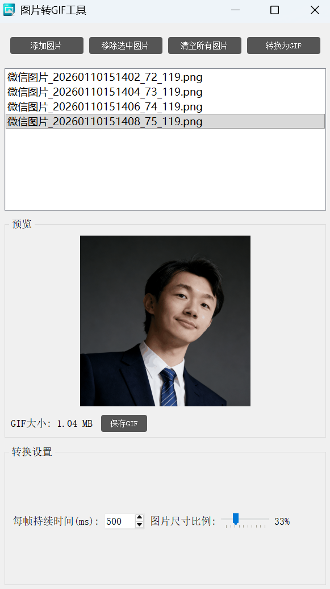
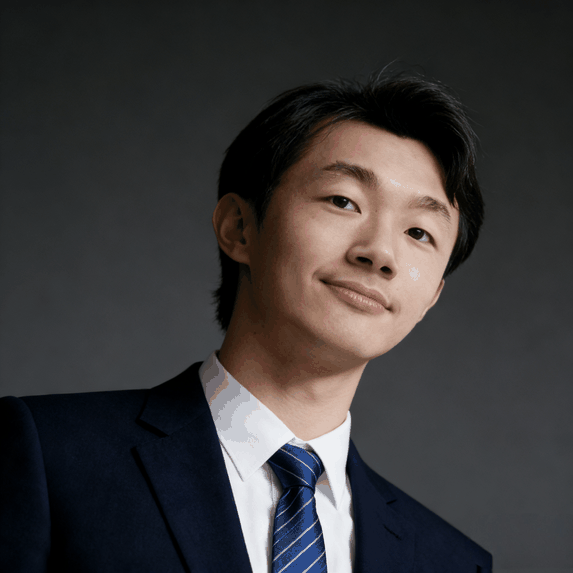

# 图片转GIF工具

这是一个简单易用的工具，可以将多张图片合并转换为GIF动画。此工具提供了用户友好的图形界面，方便您快速制作GIF动画。
[exe软件下载](https://github.com/JingW-ui/PI-MAPP/releases/tag/img2gif1.0.0.0)
## UI预览




## 功能特点

- 添加多张图片到转换队列
- 移除或清空已添加的图片
- 预览选中的图片
- 调节GIF动画每帧的持续时间
- **新增功能：通过滑块调节导出图片的像素大小（如80%大小、60%大小等）**
- 实时预览调整后的图像尺寸
- 后台转换，支持进度显示
- 支持多种图片格式（PNG, JPG, JPEG, BMP, TIFF）

## 新增功能详情

### 尺寸控制滑块
- 通过滑块控制图片尺寸比例，范围从10%到100%
- 实时显示当前设定的百分比
- 在预览区域可以看到原始尺寸和调整后尺寸的信息

### 预览功能增强
- 预览时可看到原始图像尺寸和按比例调整后的尺寸
- 当滑块值改变时，预览会自动更新显示调整后的效果

### 转换过程尺寸调整
- 转换过程中会按照设定的比例调整所有图片的尺寸
- 使用高质量的LANCZOS重采样算法确保缩放后图像质量

## 使用方法

1. 点击"添加图片"按钮，选择需要转换的图片文件
2. 如需调整，可以通过滑块设置导出图片的尺寸比例
3. 在预览区域查看图片效果和尺寸信息
4. 设置每帧的持续时间
5. 点击"转换为GIF"按钮，选择保存位置
6. 等待转换完成

## 系统要求

- Python 3.x
- PyQt5
- Pillow (PIL)

## 安装依赖

```bash
pip install PyQt5 Pillow
# 打包
pyinstaller -F -w -i img\app.ico --add-data "img;img" img2gif.py
```