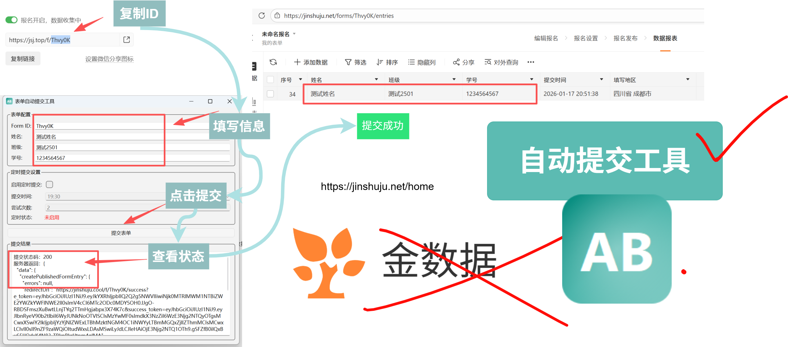

# 表单自动提交工具

有体验过在这个网址https://jsj.top/f/Thvy0K 抢不到名额的槽糕体验吗，有这个工具你将不再担心
这是一个针对该网址开发的表单自动提交工具，无需担心再也抢不到活动名额。
提供绿色可执行文件[点击获取](https://github.com/JingW-ui/PI-MAPP/releases/)



## 功能特点

- 可视化界面，操作简单
- 仅需获取Form ID即可（链接最后一个斜杆后的字母）
- 支持自定义Form ID、姓名、班级、学号字段
- 实时显示提交结果
- 基于原脚本的请求逻辑，确保兼容性
- 目前仅支持提交姓名、班级、学号三个字段

## 项目结构

```
auto_submit_web/
├── auto_main.py            # 原始命令行脚本
├── auto_submit_ui.py       # PyQt6 GUI版本
├── auto_submit_tkinter.py  # Tkinter GUI版本（Python自带库实现）
├── build.bat               # 一键打包脚本
└── README.md               # 项目说明文档
```

## 依赖安装

### PyQt6版本

```bash
pip install PyQt6 requests
```

### Tkinter版本

Tkinter是Python自带库，无需额外安装：

```bash
pip install requests
# 可选：安装playwright用于自动分析表单结构
pip install playwright
playwright install
```

## 使用方法

### 1. GUI版本

#### PyQt6版本

运行PyQt6界面版本：

```bash
python auto_submit_ui.py
```

#### Tkinter版本

运行Tkinter界面版本（无需额外安装GUI库）：

```bash
python auto_submit_tkinter.py
```

在界面中填写以下信息：
- **Form ID**：表单标识符（默认：NZCgUR）
- **姓名**：提交的姓名（如：吕小布）
- **班级**：提交的班级（如：食研2501）
- **学号**：提交的学号（如：8888888888）

点击"提交表单"按钮，在结果区域查看提交状态和服务器响应。

### 2. 命令行版本

运行原始命令行脚本：

```bash
python auto_main.py
```

## 打包成可执行文件

使用PyInstaller将GUI版本打包为Windows可执行文件：

### 安装PyInstaller

```bash
pip install pyinstaller
```

### 打包命令

#### PyQt6版本

```bash
pyinstaller --onefile --windowed --name="表单自动提交工具1.0.1" auto_submit_ui.py
pyinstaller -F -w -i b.ico --add-data "b.ico;." --name="auto_Submit_1.1.5" auto_submit_ui.py
```

#### Tkinter版本

```bash
pyinstaller --onefile --windowed --name="AutoSubmitTool" auto_submit_tkinter.py
```

或者使用提供的批处理文件一键打包：

```bash
build.bat
```

### 打包选项说明
- `--onefile`：生成单个可执行文件
- `--windowed`：不显示命令行窗口（仅适用于GUI程序）
- `--name`：指定可执行文件名称
- `-F`：`--onefile`的缩写
- `-w`：`--windowed`的缩写
- `-i`：指定图标文件
- `--add-data`：添加额外的数据文件

打包完成后，可执行文件将生成在`dist`目录中。

## 注意事项

1. 确保网络连接正常
2. 请勿频繁提交，避免给服务器造成压力
3. 提交的数据将直接发送到指定的GraphQL接口
4. 如遇到"Variables mismatch"错误，请检查Form ID是否正确

## 更新日志

- 2025-12-16：修复URL硬编码问题，支持动态Form ID
- 2025-12-16：创建PyQt6 GUI版本
- 2025-12-16：初始版本发布

## 许可证

本项目采用MIT许可证。