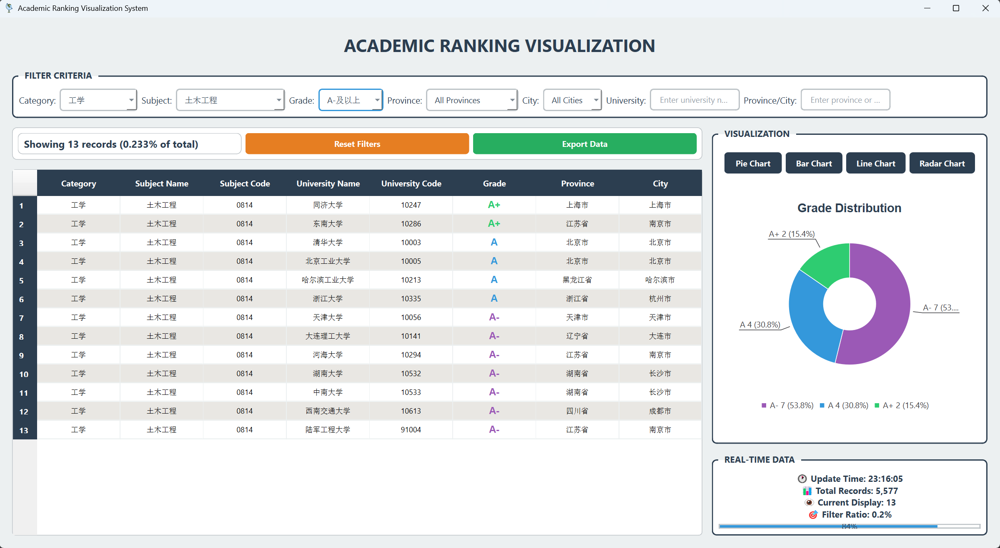

# 学科排名可视化系统

> 基于 PySide6 的交互式学科评估数据浏览器，支持 5570 条学科排名记录的动态筛选、搜索与可视化。
> 本来最好的方式是做一个网站的 但是要服务器 还是做本地的UI 方便一点！

---

## ✨ 特性速览
| 功能 | 说明 |
|---|---|
| 🎨 **现代化 UI** | 渐变背景、圆角卡片、半透明控件、悬停动效 |
| 🔍 **多条件筛选** | 学科名称、学科门类、评估等级三联动下拉框 |
| 🔎 **实时搜索** | 学校名称即时模糊搜索 |
| 📊 **一键图表** | 饼图（等级分布）、柱状图（学科数量）、折线图（等级趋势） |
| ⚡ **动态反馈** | 标题掉落动画、进度条、实时数据状态面板 |
| 📈 **统计弹窗** | 一键弹出全局数据摘要与等级占比 |

---

## 🚀 30 秒上手

### 1. 安装依赖
```bash
pip install PySide6 pandas
```

### 2. 准备数据
数据已爬取完成 不必担心！
### 3. 启动应用
```bash
python subject_ranking_app.py
```

---

## 🎯 界面导览


### 快捷键
| 键位 | 功能 |
|---|---|
| `Ctrl+F` | 聚焦搜索框 |
| `Ctrl+R` | 重新加载数据 |
| `Esc` | 清空所有筛选 |

---

## 📊 图表说明
1. **饼图**：当前筛选结果下各评估等级占比，色盘与表格一致。  
2. **柱状图**：展示前 10 个学科的记录条数，可快速识别热门学科。  
3. **折线图**：按 A+ → C- 顺序展示等级数量变化，直观看出“中段集中”或“两极分化”。

---

## 🛠️ 二次开发提示
- 主题色：修改 `setStyleSheet()` 内 `qlineargradient` 即可一键换肤。  
- 新图表：继承 `update_chart()`，在 `chart_type == "your_name"` 分支下新增 `Q*Series` 即可。  
- 大数据优化：将 `self.data` 改为 `QSortFilterProxyModel` + `QTableView`，可支持 10 万行无卡顿。  
- 打包发布：`pip install fbs-qt6` 后 `fbs run/build` 即可生成独立安装包。

---

## 📄 许可证
MIT © 2024 junior6666
