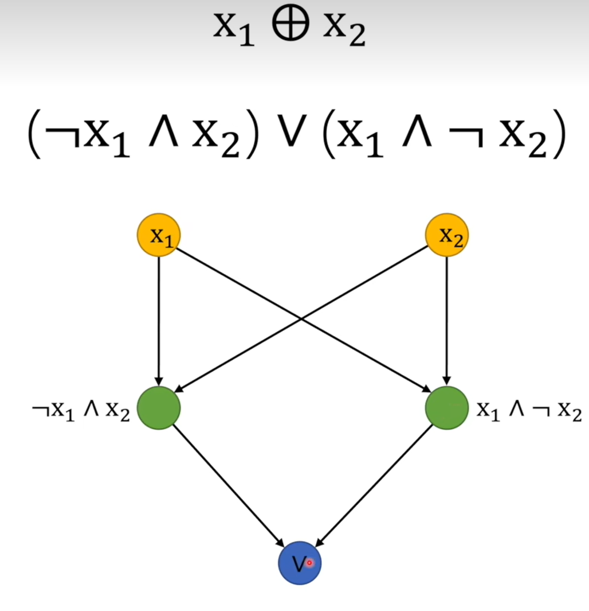

## 上链接 https://zhuanlan.zhihu.com/p/712340464
## 上链接 https://zhuanlan.zhihu.com/p/492867531
视频教程：https://www.bilibili.com/video/BV1uB4y1M7Ju/?spm_id_from=333.337.search-card.all.click&vd_source=ea444bcb59e16e58cfdca990f3514384
###  可以解决线性可分二分类问题
## 与或非的基础知识点击链接查看和 Kimi 的对话 https://www.kimi.com/share/d395hpn60ra7esmls5r0
User: 与或非的符号
Kimi: 在逻辑学和数字电路中，“与”、“或”、“非”的符号表示如下：

| 逻辑运算 | 中文名称 | 数学符号 | 数字电路符号 | 其他常见符号 |
|----------|----------|----------|--------------|--------------|
| 与       | AND      | ∧        | ·            | A·B, AB      |
| 或       | OR       | ∨        | +            | A+B          |
| 非       | NOT      | ¬        | ‾ (上横线)   | A', ~A       |

例如：

- 与：A ∧ B 或 A·B
- 或：A ∨ B 或 A+B
- 非：¬A 或 A̅
User: 异或 与非的符合呢？如何直观理解？
Kimi: ### 异或（XOR）和与非（NAND）的符号与直观理解

#### **1. 异或（XOR）**
- **符号**：
  - 数学符号：⊕（圆圈加号）
  - 数字电路符号：⊕ 或 XOR
- **真值表**：
  | A | B | A ⊕ B |
  |---|---|-------|
  | 0 | 0 |   0   |
  | 0 | 1 |   1   |
  | 1 | 0 |   1   |
  | 1 | 1 |   0   |
- **直观理解**：
  - **“不同为真”**：输出为1当且仅当输入的两位不同。
  - **“二进制加法无进位”**：类似1+1=0（无进位），即相同为0，不同为1。
  - **例子**：密码学中简单加密（如一次性密码本）用异或，因为相同密钥异或两次会还原原文。

#### **2. 与非（NAND）**
- **符号**：
  - 数学符号：↑（谢费尔竖线，Sheffer stroke）
  - 数字电路符号：AND门输出加小圆圈（表示非），即 `A ∧ B` 的否定。
- **真值表**：
  | A | B | A ↑ B |
  |---|---|-------|
  | 0 | 0 |   1   |
  | 0 | 1 |   1   |
  | 1 | 0 |   1   |
  | 1 | 1 |   0   |
- **直观理解**：
  - **“先与后非”**：先计算与（AND），再对结果取反。
  - **“通用门”**：仅用NAND门可构建所有其他逻辑门（如AND、OR、NOT），是数字电路的“原子”。
  - **例子**：CPU内部多数逻辑由NAND门组合实现，因物理实现更简单。

#### **对比记忆**
- **异或**：像“挑剔的比较器”，只认可差异。
- **与非**：像“悲观的法官”，只有所有输入都真时才否决（输出0）。
User: 那如何直观的将异或用与或非进行组成？采用真值表嘛？
Kimi: 对，**真值表是“第一性原理”**，先把异或（XOR）的 1 行全部拎出来，再用“与-或-非”去“覆盖”这些 1，就能一眼看出怎么拼。

下面给你一张“真值表 → 最小项 → 与或非” 的完整路线图，保证一眼看懂。

---

### 1️⃣ 先列真值表，把输出为 1 的行标出来

| A | B | XOR |
|---|---|-----|
| 0 | 0 |  0  |
| 0 | 1 |  1  | ← 要覆盖
| 1 | 0 |  1  | ← 要覆盖
| 1 | 1 |  0  |

---

### 2️⃣ 把每一行 1 写成“最小项”（用与+非）

- 第 2 行：A=0, B=1 → ¬A ∧ B  
- 第 3 行：A=1, B=0 → A ∧ ¬B  

这两行就是 XOR 的全部 1，因此：

**XOR = (¬A ∧ B) ∨ (A ∧ ¬B)**   

这就是“与-或-非”形式，已经拼好了。

---

### 3️⃣ 画成门级电路，直观验证

```
        ┌───┐
A ──────┤NOT├──────┐
        └───┘      │
                   ├───┐
B ─────────────────┤AND├──┐
                   └───┘  │
        ┌───┐            │
B ──────┤NOT├──────┐     │
        └───┘      │     │
                   ├───┐ │    ┌───┐
A ─────────────────┤AND├─┼────┤OR ├─→ XOR
                   └───┘ │    └───┘
        ┌───┐            │
A ──────┤NOT├──────┐     │
        └───┘      │     │
                   ├───┐ │
B ─────────────────┤AND├─┘
                   └───┘
```

（文字描述：两条支路各做一个“与”门，输入都是一端原变量、一端反变量；再把两条支路输出送进一个“或”门，出来的就是 XOR。）

---

### 4️⃣ 一句话口诀

> **“要么 A 反且 B，要么 A 且 B 反”**  
> 用与或非写就是：  
> **XOR = (¬A ∧ B) ∨ (A ∧ ¬B)**

真值表 → 最小项 → 或起来，这就是把任意逻辑函数拆成与或非的“万能套路”。
User: 解释一下最小项是什么？
Kimi: 最小项就是**“让函数输出为 1 的那一行输入，所对应的一个唯一与项”**。

一句话：  
> 每一行真值表，都可以写成一个“所有变量（原或反）一起与”的乘积，这个乘积就叫**最小项**。

---

### 1️⃣ 为什么叫“最小”
- 它只覆盖真值表里**一个**格子。  
- 再想缩小就不可能了——去掉任何一个变量，就会多覆盖至少一行，所以它是“最小不可再分”的与项。

---

### 2️⃣ 三变量例子（把定义放大一点）

函数 F(A,B,C) 的真值表某一行：

| A | B | C | F |
|---|---|---|---|
| 0 | 1 | 1 | 1 | ← 这一行要 1

对应最小项写法规则：

- 变量值是 0 → 写它的**反**  
- 变量值是 1 → 写它的**原**

于是这一行的最小项就是：

**¬A ∧ B ∧ C**  
（有人简记为 m₃，因为 011₂ = 3）

---

### 3️⃣ 二变量回顾 XOR

| A | B | XOR |
|---|---|-----|
| 0 | 1 |  1  | → ¬A ∧ B  
| 1 | 0 |  1  | → A ∧ ¬B  

把这两个最小项“或”起来，就得到：

**XOR = (¬A ∧ B) ∨ (A ∧ ¬B)**

---

### 4️⃣ 记忆口诀

> **“一行一与，原反看表；全部 1 行，或起来搞定。”**

这就是“最小项之和”——把函数为 1 的每一行都写成最小项，再全部或起来，一定能还原出原函数，也是最直观的与-或-非表达式。

## 我的总结
感知机：单层就只能解决二分类问题，与 或 非
单层不能解决异或问题 不能线性可分 导致神经网络的寒冬
10几年后 通过套娃 解决
将两个感知机的输出给到第三个感知机 如下公式所示：**XOR = (¬A ∧ B) ∨ (A ∧ ¬B)**
#### 
