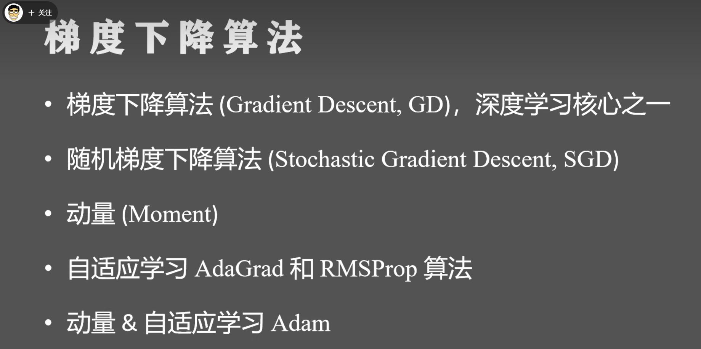
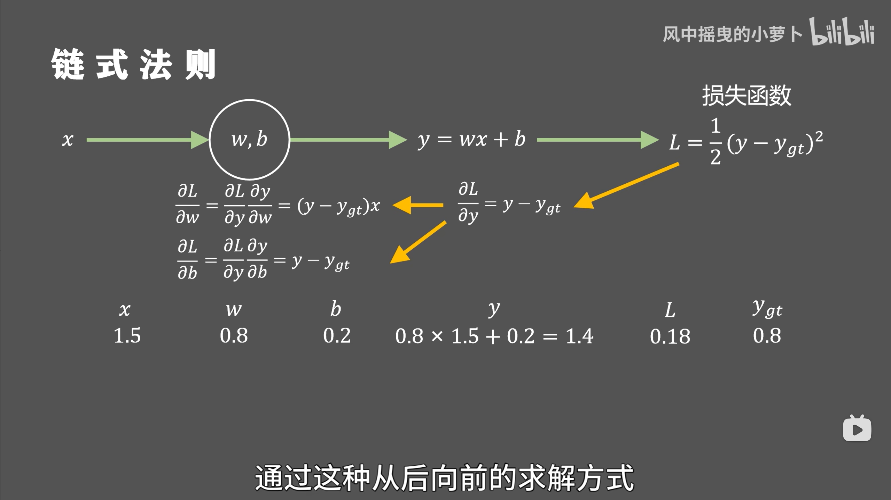
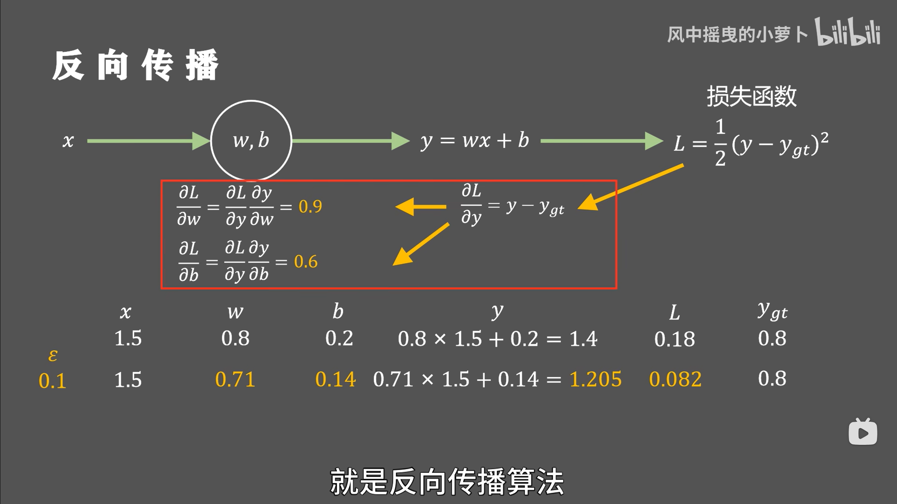
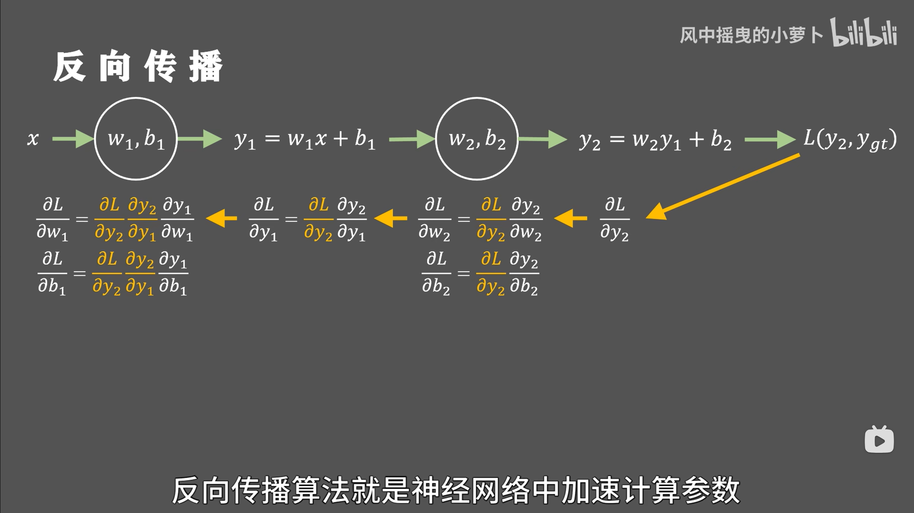
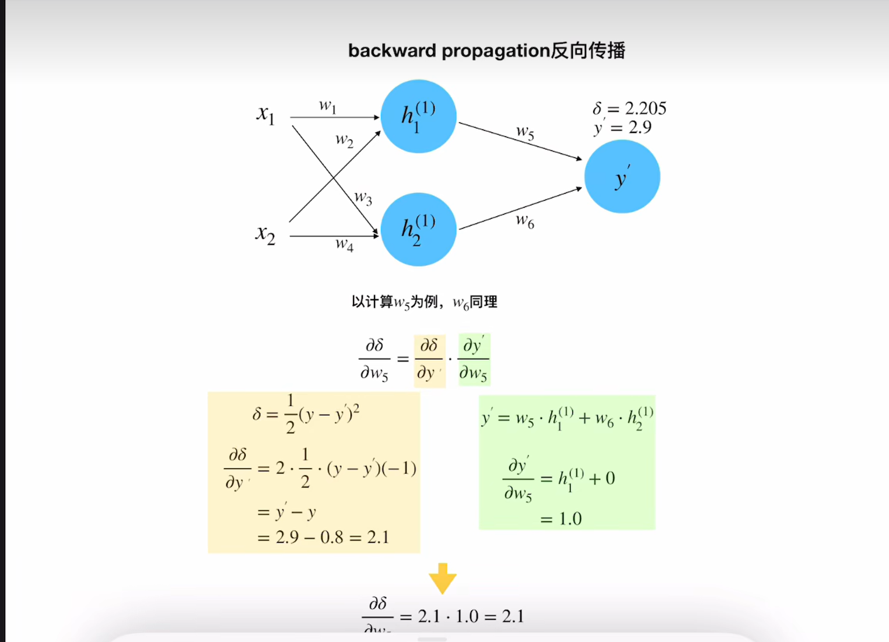

## 梯度下降算法 从动量 学习率这个两个角度去理解
这个up主确实讲的不错
https://www.bilibili.com/video/BV1oY411N7Xz?spm_id_from=333.788.videopod.sections&vd_source=ea444bcb59e16e58cfdca990f3514384

根据梯度下降算法，我们来理解一下这个公式

那这个就是反向传播算法的精髓了

同理加入两个线性变换 从后往前求偏导 更新参数

具体反向传播算法的计算步骤看这个UP
https://www.bilibili.com/video/BV1QV4y1E7eA/?spm_id_from=333.337.search-card.all.click&vd_source=ea444bcb59e16e58cfdca990f3514384

**记住一个求偏导的基础知识：求某个变量的偏导 那么该变量就是变量其他的都是常数！！**

